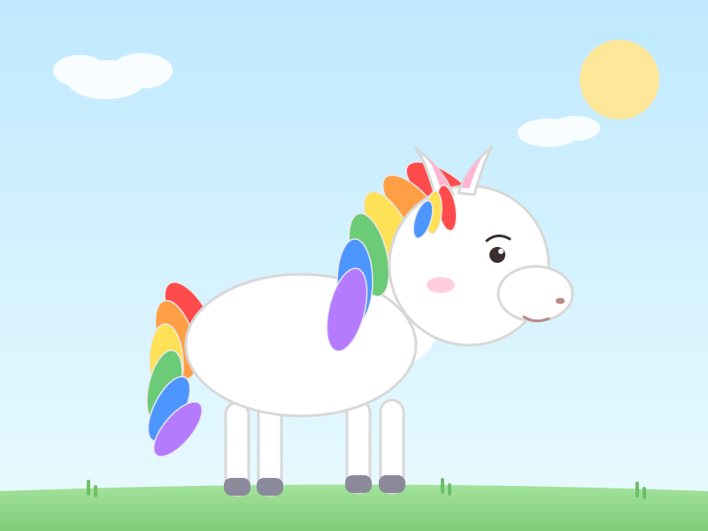

# 🌈 Rainbow Pony

## Intro

Hello, maybe no one would notice me but this is my first time use github and advanced ai tools in 2026/7/9;
Here is my first work in Github, hope you guys will not like it "q_q"

## Code

Pure SVG, no image assets — the code below *is* the picture.

```svg
<svg xmlns="http://www.w3.org/2000/svg" viewBox="0 0 800 600" width="800" height="600">
  <defs>
    <linearGradient id="sky" x1="0" y1="0" x2="0" y2="1">
      <stop offset="0%" stop-color="#BFE9FF"/>
      <stop offset="100%" stop-color="#EAFBFF"/>
    </linearGradient>
    <linearGradient id="grass" x1="0" y1="0" x2="0" y2="1">
      <stop offset="0%" stop-color="#A8E6A1"/>
      <stop offset="100%" stop-color="#7FCB77"/>
    </linearGradient>
  </defs>

  <!-- sky -->
  <rect x="0" y="0" width="800" height="600" fill="url(#sky)"/>

  <!-- sun -->
  <circle cx="700" cy="90" r="45" fill="#FFE79A"/>

  <!-- clouds -->
  <g fill="#FFFFFF" opacity="0.9">
    <ellipse cx="120" cy="90" rx="45" ry="22"/>
    <ellipse cx="160" cy="80" rx="35" ry="20"/>
    <ellipse cx="90" cy="80" rx="30" ry="18"/>

    <ellipse cx="620" cy="150" rx="35" ry="16"/>
    <ellipse cx="650" cy="145" rx="28" ry="14"/>
  </g>

  <!-- ground -->
  <path d="M0,555 Q400,540 800,555 L800,600 L0,600 Z" fill="url(#grass)"/>
  <g stroke="#6FBE68" stroke-width="4" stroke-linecap="round">
    <path d="M100,558 l0,-14"/>
    <path d="M108,560 l0,-10"/>
    <path d="M500,556 l0,-14"/>
    <path d="M508,558 l0,-10"/>
    <path d="M720,560 l0,-14"/>
    <path d="M728,562 l0,-10"/>
  </g>

  <!-- ===== TAIL (rainbow) ===== -->
  <g stroke="#E8E8E8" stroke-width="1.5">
    <ellipse cx="215" cy="360" rx="20" ry="46" fill="#FF4B4B" transform="rotate(150 215 360)"/>
    <ellipse cx="199" cy="384" rx="20" ry="46" fill="#FF9F45" transform="rotate(163 199 384)"/>
    <ellipse cx="188" cy="410" rx="19" ry="44" fill="#FFE156" transform="rotate(178 188 410)"/>
    <ellipse cx="186" cy="437" rx="18" ry="42" fill="#6BCB77" transform="rotate(-167 186 437)"/>
    <ellipse cx="191" cy="462" rx="17" ry="40" fill="#4D96FF" transform="rotate(-153 191 462)"/>
    <ellipse cx="201" cy="485" rx="16" ry="38" fill="#B57BFF" transform="rotate(-140 201 485)"/>
  </g>

  <!-- ===== LEGS ===== -->
  <g fill="#FFFFFF" stroke="#D8D8D8" stroke-width="3">
    <rect x="255" y="455" width="26" height="105" rx="13"/>
    <rect x="292" y="455" width="26" height="105" rx="13"/>
    <rect x="392" y="452" width="26" height="105" rx="13"/>
    <rect x="430" y="452" width="26" height="105" rx="13"/>
  </g>
  <g fill="#8A8A9A">
    <rect x="253" y="540" width="30" height="20" rx="8"/>
    <rect x="290" y="540" width="30" height="20" rx="8"/>
    <rect x="390" y="537" width="30" height="20" rx="8"/>
    <rect x="428" y="537" width="30" height="20" rx="8"/>
  </g>

  <!-- ===== BODY ===== -->
  <ellipse cx="440" cy="350" rx="55" ry="65" fill="#FFFFFF" transform="rotate(-25 440 350)"/>
  <ellipse cx="340" cy="390" rx="130" ry="80" fill="#FFFFFF" stroke="#D8D8D8" stroke-width="3"/>

  <!-- ===== MANE (rainbow) ===== -->
  <g stroke="#E8E8E8" stroke-width="1.5">
    <ellipse cx="500" cy="215" rx="20" ry="48" fill="#FF4B4B" transform="rotate(-55 500 215)"/>
    <ellipse cx="468" cy="236" rx="20" ry="48" fill="#FF9F45" transform="rotate(-42 468 236)"/>
    <ellipse cx="440" cy="260" rx="20" ry="48" fill="#FFE156" transform="rotate(-28 440 260)"/>
    <ellipse cx="417" cy="288" rx="20" ry="48" fill="#6BCB77" transform="rotate(-14 417 288)"/>
    <ellipse cx="401" cy="318" rx="20" ry="48" fill="#4D96FF" transform="rotate(0 401 318)"/>
    <ellipse cx="392" cy="350" rx="20" ry="48" fill="#B57BFF" transform="rotate(14 392 350)"/>
  </g>

  <!-- ===== HEAD ===== -->
  <circle cx="530" cy="300" r="90" fill="#FFFFFF" stroke="#D8D8D8" stroke-width="3"/>
  <ellipse cx="605" cy="332" rx="42" ry="31" fill="#FFFFFF" stroke="#D8D8D8" stroke-width="3"/>

  <!-- ears -->
  <g>
    <path d="M492,222 Q480,180 470,168 Q500,190 512,220 Z" fill="#FFFFFF" stroke="#D8D8D8" stroke-width="3" stroke-linejoin="round"/>
    <path d="M498,214 Q490,188 483,178 Q502,194 508,213 Z" fill="#FFB6D1"/>

    <path d="M536,220 Q548,178 556,166 Q528,188 518,218 Z" fill="#FFFFFF" stroke="#D8D8D8" stroke-width="3" stroke-linejoin="round"/>
    <path d="M530,213 Q539,187 545,177 Q527,192 522,212 Z" fill="#FFB6D1"/>
  </g>

  <!-- blush -->
  <ellipse cx="498" cy="322" rx="16" ry="9" fill="#FF9EBB" opacity="0.5"/>

  <!-- eye -->
  <circle cx="562" cy="288" r="9" fill="#3A2E2E"/>
  <circle cx="566" cy="284" r="3" fill="#FFFFFF"/>
  <path d="M550,272 Q562,262 576,270" fill="none" stroke="#3A2E2E" stroke-width="3" stroke-linecap="round"/>

  <!-- nostril -->
  <ellipse cx="633" cy="340" rx="5" ry="3.5" fill="#B98A8A"/>

  <!-- mouth -->
  <path d="M592,358 Q604,366 620,360" fill="none" stroke="#B98A8A" stroke-width="3" stroke-linecap="round"/>

  <!-- forelock (little rainbow tuft on forehead) -->
  <g stroke="#E8E8E8" stroke-width="1.5">
    <ellipse cx="505" cy="235" rx="10" ry="26" fill="#FF4B4B" transform="rotate(-10 505 235)"/>
    <ellipse cx="490" cy="240" rx="9" ry="24" fill="#FFE156" transform="rotate(5 490 240)"/>
    <ellipse cx="478" cy="248" rx="9" ry="22" fill="#4D96FF" transform="rotate(18 478 248)"/>
  </g>
</svg>
```

Full source file: [`rainbow_pony.svg`](./rainbow_pony.svg)

## Image


